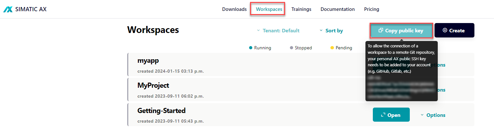

# Standardizer Tutorial (only cloud based)

In this standardizer tutorial, you'll learn about all the important tools necessary to develop a ST library with SIMATIC AX.

Although this tutorial focuses on the cloud IDE, the workflows are very similar in the local IDE. Differences will be noted in the tutorial, but not explained in detail.

After this tutorial, you will:

- know the basics about Apax
- be familiar with OOP in ST
- know how to use the AxUnit testing framework
- be able to write simple test classes
- be familiar with writing parameterized tests
- understand how to use the debugging extension
- are able to create your own package and know how to publish it

This tutorial is structured in multiple sequential chapters. Be sure to read [Apax package manager usage](./doc/setup.md) first, as it contains necessary steps to enable work later in tutorial. All other chapters can be read in any order, but note that [Write own unit tests with AxUnit](./doc/write-tests.md) depends on [Introduction in OOP](./doc/oop-introduction.md).

## Training chapters

- [Apax package manager usage](./doc/setup.md) (mandatory for all other chapters)
- [Introduction to OOP](./doc/oop-introduction.md)
- [User defined snippets](./doc/user-defined-snippets.md)
- [Usage of the testing framework](./doc/testing-framework.md)
- [Write own unit tests with AxUnit](./doc/write-tests.md) (depends on [Introduction in OOP](./doc/oop-introduction.md))
- [Parameterized tests](./doc/parametrized-tests.md)
- [Debugging of tests](./doc/test-debugging.md)
- [Packing and publishing libraries](./doc/publishing-lib.md)

## Prerequisites

- You have access to the [web IDE](https://axcite.me)
- You can login into the AX registry
- Your `public SSH key` from AX is added to your GitHub profile:
  - [how to get your public SSH key from AX](#how-to-get-a-your-public-ssh-key-from-ax)
  - [how to add a SSH key on GitHub](https://docs.github.com/en/authentication/connecting-to-github-with-ssh/adding-a-new-ssh-key-to-your-github-account)
  - >Note: you need this public key to be able to clone the repository in the cloud IDE

- You've created a valid personal access token to access the GitHub registry
  - [create personal access token on GitHub](https://docs.github.com/en/authentication/keeping-your-account-and-data-secure/creating-a-personal-access-token)
  - >Note: You need this token to login into the `simatic-ax` GitHub registry (URL: <https://npm.pkg.github.com/>) with `apax login`

## How to get a your public SSH key from AX

- open the [workspace manager](https://console.simatic-ax.siemens.io/workspaces) in AX
- Click on the button `Copy public key`

    

- [further documentation](https://console.simatic-ax.siemens.io/docs/axcode/source-code-management#cloning-in-the-cloud)

## Contribution

Thanks for your interest in contributing. Anybody is free to report bugs, unclear documentation, and other problems regarding this repository in the Issues section or, even better, propose any changes to this repository using Pull Requests.

### Markdownlint-cli

This workspace will be checked by the [markdownlint-cli](https://github.com/igorshubovych/markdownlint-cli) (there is also documented ho to install the tool) tool in the CI workflow automatically.  
To avoid, that the CI workflow fails because of the markdown linter, you can check all markdown files locally by running the markdownlint with:

```sh
markdownlint **/*.md --fix
```

## License and Legal information

Please read the [Legal information](LICENSE.md)
