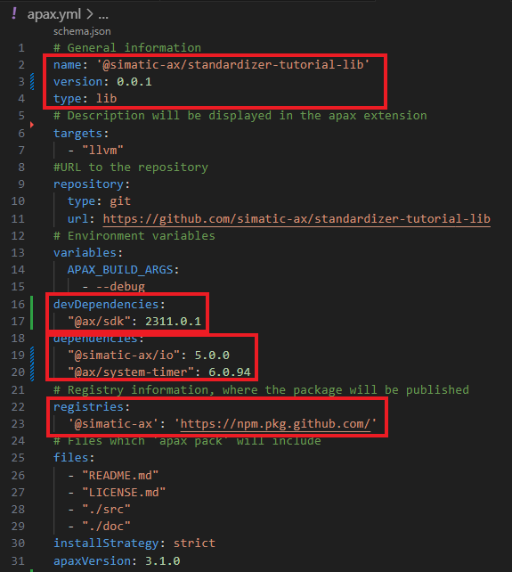
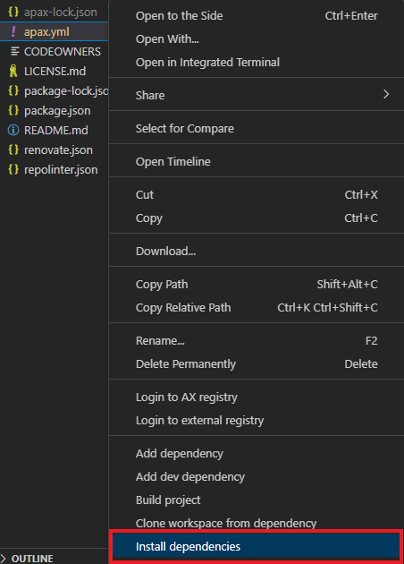
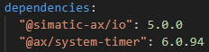

# Standardizer Tutorial (only cloud based)

The standardizer tutorial consists of multiple separate sequential chapters from the perspective of a standardizer. 
In this tutorial, you'll develop, test and create AX library. 
Altough the tutorial focusses on the cloud IDE, the workflows are very similar within the local IDE. Differences will be mentioned in within the tutorial, but not explained in detail.

Chapters:
- Apax package manager usage
- Writing libraries in OOP
- Using the testing framework
- Debugging of tests
- Packing and publishing libraries


## Prerequisities
- Access to axite.me WebIDE
- able to login into the AX registry
- a valid GitHub token to access the GitHub registry //TODO link how to create an token


# Setup your library environment

## Goal for this trainig chapter
After this traing session:
- you are able to create workspaces with clone link in the WebIDE
- the login process in to the AX registry is known
- the login into other (external) registries is known
- you've a rough overview about the apax.yml
- you can learn how to install dependencies
- you have hered, that there are different project types `lib`/`app`
- and you've hered the differnece beween `devDependencies` and `dependencies`
- you know how to add further dependencies

### Cloning the workspace with clone link
1. Copy the clone link to your clipboard:

    ```
    git@github.com:simatic-ax/standardizer-tutorial-lib.git
    ```
1. Open the cloud IDE on https://axcite.me/workspaces
    > it's possible that you've to login first

1. Click on create 

1. Select `Clone from Git`, paste the clone link into the `REPOSITORY` field and press `Create`. Wait until the workspace is created.  

   
    > WARNING: If your public key of AX is not in your GitHub profile, the creation of the tutorioal will fail. 

1. Open the wokspace

### Login into AX registry

Before we continue with that tutorial, you've to login into the AX registry to be able to install the AX SDK. 

1. click on `Log in to AX to download extentions and Aax packages`
    
    
    a new broswer window opens

1. copy the token into your clipboard by clicking `Copy`
    
    

1. Switch back to workspace

1.  Select `enter token manually`

      

1. Enter token with `Strg+V` (**don't select "paste" from the context menu**)  

   

### Login to other registry 

For this tutorial are further libraries required, which are hosted at a GitHub registry @ax-showcase. To consume them, it is necessary to login into the GitHub registry.

1. select the file `apax.yml`, click the right mouse button and select `Login to registry`

      

1. Enter the github URL

       

1. Leave the user name field empty and press `Enter`
    
      

1. Enter your personal access token from GitHub with `Strg+V`

      

Now youre able to install all dependencies to develop on your library.
### Content of apax.yml

If you're already fimilar with `Apax` and the `apax.yml`

When you want to devlop a library with AX then you need some developer tools. It's called SDK. The AX SDK containes some komponents like:
    - AX Compiler
    - AxUnit festing framework
    - Simatic downloader
    - ...

For this tutorial just the compiler and the AxUnit Testing framework are interestig. This tutorial uses some furter dependencies from GitHub.

Before we intall all required dependencies, lets have a look into the apax.yml. The apax.ymal is a configuration file for the Apax package manager. It contains all relevant information for the workspace.

  

#### **Project information**

In the header of this file you finde some information about the project.

- `name: standardizer-tutorial-lib` Contains the project name. In this case the library has the name `standardizer-tutorial-lib`
- `version: 0.0.1` the version of the library.
- `type: lib` the project type is lib (library project) anothe rvalid value is `app` (Application)
> Note:  
> - a library need always a namespace
> - a library can not be executed directly on a PLC
> - because a library must not have a `CONFIGURATION` and a `PROGRAM` section, which is necessary to be executed on a PLC

#### **devDependencies**
This section contains dte dependencies,, which are necessary during the development. Here just the `@as/sdk` in version `0.2.499` is required.

#### **dependencies** and **registries**
In this tutorial we also need some other libraries. Hence this are dependencis which are necessary for building the library. 

In this example, there are two further libraries form the `@ax-showcase` registry required. 

For the moment, it's not important to know what the conten of this libraries is. This libraries are hosted on GitHub. So we've to tell apax, where the GitHub Registry is located. This will be done in the section `registries`
The URL of the Github fegistry is:
```
https://npm.pkg.github.com/
```

### Install dependencies

1. Right click on the `apax.yml` and select `Install dependencies`
    
      

1. Wait until a the message appears

      

**Alternative workflow:**
You can open a terminal (e.g. by pressing `STRG+SHIFT+ö` German keyboard layout) and enter 

```
apax install -L 
```

This command is equivalent to `Install dependencies`


### Adding dependencies 

Further dependencies can be added also via command line if you know the name of the package.

Example:
Install the system library system-timer

```
apax add @ax/system-timer
```

If you do so, you can find a additional entry in th `apax.yml` in the section `dependencies`.

  

If you wondering, why this version is set with `^`0.4.2. That means that at minimum version 0.4.2 has to be used. If there a version 0.4.3 available, the version 0.4.3 will be installed. 

//TODO apax extention


### Summary

Goal of this training chapter was:
- you are able to create workspaces with clone link in the WebIDE
- the login process in to the AX registry is known
- the login into other (external) registries is known
- you've a rough overview about the apax.yml
- you can learn how to install dependencies
- you have hered, that there are different project types `lib`/`app`
- and you've hered the differnece beween `devDependencies` and `dependencies`
- you know how to add further dependencies


#  Writing libraries in OOP
## Goal for this trainig chapter

After this training session:
- you are able to create a new ST-File
- you know how to define a namespace
- you know how a class and methods will be declared
- you have implemented an interface
- you're familiar with the `USING` keyword
- are able to declare `PRIVATE` and `PUBLIC` variables
- you've seen an example for a enumeration and you know how to use enumerations
- you know how you find a 'Definition'

Not part of this tutorial is:
- achieve knowldege about object orientaed programming
- realizing OOP design patterns

### Create a new ST file

1. Open the `EXPLORER` view 
    
    

1. Select the `src` folder + right mouse click
    
    

    > ST filed with ST code must be located in the `src folder`

1. Ener the file name `Valve.st`

    

### Define the namespace

In ST you can define namespaces with:
```
NAMESPACE Simatic.Ax.Tutorial
    // your code
END_NAMESPACE
```

or equivalent

```
NAMESPACE Simatic
    NAMESPACE Ax
        NAMESPACE Tutorial
            // your code
        END_NAMESPACE
    END_NAMESPACE
END_NAMESPACE
```

1. Open the file `Valve.st`
1. Create the nampespace `Simatic.Ax.Tutorial`

###  Declare the class Valve

1. type `class` and a snippet `class, Class` should be provided.Select it and press `enter`

    

    Result:

    ```
    NAMESPACE Simatic.Ax.Tutorial
        CLASS Valve
            VAR
                
            END_VAR
        END_CLASS
    END_NAMESPACE
    ```

### Implement the interface IValve
Since Valve is a kind of any valve, the interface IValve shall be implemented.

1. Implement IValve by enter `IMPLEMENTS IValve` after `CLASS Valve`

    ```
    NAMESPACE Simatic.Ax.Tutorial
        CLASS Valve IMPLEMENTS IValve
            VAR
                
            END_VAR
        END_CLASS
    END_NAMESPACE
    ````

1. Fix the error `CLASS 'Valve' doesn't implement INTERFACE 'IValve'`
    This error means, that the expected methods from IValve are not implemented.
    In this case, hover with your mouse cursor over `IValve` and select `Quick fix...` OR press `CRTL+.`

    

1. Click on `Implement missing Methods`
    
    

    Result:
    
    ```
    NAMESPACE Simatic.Ax.Tutorial
    CLASS Valve IMPLEMENTS IValve
        VAR
            
        END_VAR
    
            METHOD PUBLIC Open
                ;
            END_METHOD

            METHOD PUBLIC Close
                ;
            END_METHOD

            METHOD PUBLIC GetState : ValveState
                ;
            END_METHOD
        END_CLASS
    END_NAMESPACE
    ```
    > eventually, you've to format the source code when the tabs are not fitting

### Decalre private variables
1. Go to the section VAR within the class `Valve`

1. Write the keyword `PRIVATE` behind var 

1. Declare the variable `_valveState : BOOL;` wihin the `VAR PRIVATE` section

    ```
    VAR PRIVATE
        _valveState : BOOL;
    END_VAR
    ```

1. Insert a new section `VAR PUBLIC` below `VAR PRIVATE ... END_VAR` and declare the variable `qValve : IBinOutput`

    Result:

    ```
    VAR PRIVATE
        _valveState : BOOL;
    END_VAR

    VAR PUBLIC
        qValve : IBinOutput;
    END_VAR
    ```

### Usage of the `USING` keyword

In the last step, you tried to declare a Variable of the type `IBinOutput`. This type is not known in the namespace `Simatic.Ax.Tutorial`. So you've to announce the namespace, where `IBinOutput` is located .

1. Go to the top of the file Valve.st

1. Insert:
    
    ```
    USING Siemens.Ax.IO.Output; 
    ``` 
    Result:
     - The syntax error disappears
    
     - your code should look like:

        ```
        USING Siemens.Ax.IO.Output;

        NAMESPACE Simatic.Ax.Tutorial
            CLASS Valve IMPLEMENTS IValve
            ...
        ```

### Impelement the methods `Open` and `Close`

Now we're implementing the interface methods.

1. Go to the method `Close` and implement the method as shown below:

    ```
    METHOD PUBLIC Close
        IF (qValve <> NULL) THEN
            qValve.SetOff();
        END_IF;
        _valveState := false;
    END_METHOD
    ```

1. Go to the method `Open` and implement the method as shown below:

    ```
    METHOD PUBLIC Open
        IF (qValve <> NULL) THEN
            qValve.SetOn();
        END_IF;
        _valveState := true;
    END_METHOD
    ```

### Usage of enumeration and `Go to definition`

The interface `IValve` expects a further method `GetState : ValveState`. The retuen value of this method is a enumeration of the type `ValveState`.

1. Implement the method GetState as below:
    
    ```
    METHOD PUBLIC GetState : ValveState
        IF (_valveState) THEN 
            GetState := ValveState#Open;
        ELSE
            GetState := ValveState#Closed;
        END_IF;
    END_METHOD
    ```

    In the case of a closed Valve, the function returns the Value `ValveState#Closed`. In the case the valve is open, the methid reurns the value `ValveState#Open`.

    > Members of enumerations can be accessed by using TypeName#Value. For example `ValveState#Closed`

1. Find the definition of `ValveState` by hovering over the word `ValveState`
1. Jump to the definition by 

    1. Press `F12`  

    1. Right mosue click and click on `Go to Definition`

        
    
    1. press `CTRL` + `click left mouse button`

    Result:
    
    The file `TypeValveStatus.st` will be opened and shows the following content:
    
    ```
    NAMESPACE Simatic.Ax.Tutorial
        TYPE
            ValveState : (Open, Closed, Error, Undefined, HardError) := Undefined;
        END_TYPE
    END_NAMESPACE
    ```

### Summary

Goal of this training chapter was:
 
## Using the testing framework
After this traing session:
- the user is able to create a own test class
- the user can write own simple tests 
- the user knows the test explorer
- the can execute tests within the IDE

## Debugging of tests
After this traing session:
- the user is able to start the debugging of tests

## Packing and publishing libraries
After this traing session:
- the user is able to pack a library
- the user knows how a library can be shipped
- ...

### Snippets
- The user has learned how a snippet can be created


# Writing a library
# Writing tests
# Packing and publishing libraries

## Storylines


## Setup your Demo

### [Web IDE](./doc/WebIDE.md)

### [AXCode (local IDE)](./doc/AxCode.md)

### [Trouble shooting](./doc/Storylines/Troubleshooting.md)
