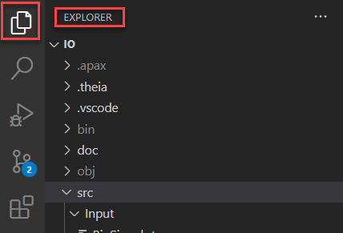
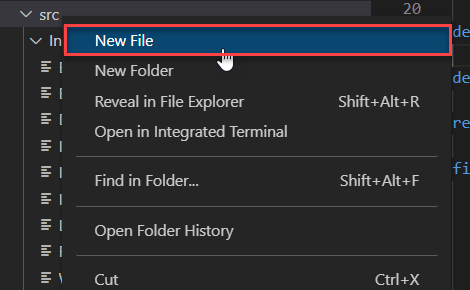
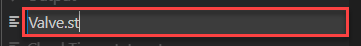
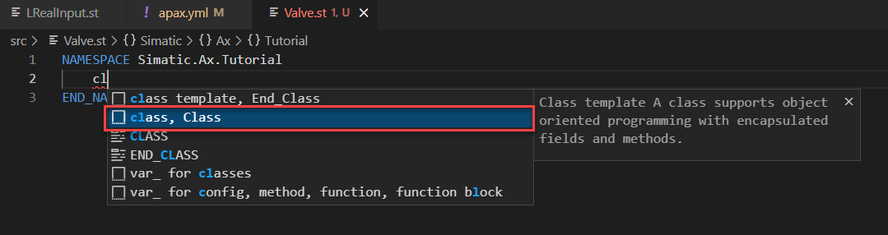
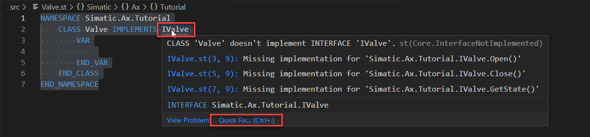

# Introduction in OOP

## Goal for this training chapter

After this training session:

- you are able to create a new ST file
- you know how to define a namespace
- you know how a class and methods will be declared
- you have implemented an interface
- you are familiar with the `USING` keyword
- are able to declare `PRIVATE` and `PUBLIC` variables
- you've seen an example for an enumeration and you know how to use enumerations
- you know how you find a 'Definition'

Not inlcuded in this tutorial:

- Achieving knowledge about object orientated programming
- Realizing OOP design patterns

### Create a new ST file

1. Open the `EXPLORER` view

    

1. Select the `src` folder + right mouse click

    

    > ST filed with ST code must be located in the `src folder`

1. Enter the file name `Valve.st`

    

### Define the namespace

In ST you can define namespaces with:

```iec-st
NAMESPACE Simatic.Ax.Tutorial
    // your code
END_NAMESPACE
```

or equivalent

```iec-st
NAMESPACE Simatic
    NAMESPACE Ax
        NAMESPACE Tutorial
            // your code
        END_NAMESPACE
    END_NAMESPACE
END_NAMESPACE
```

1. Open the file `Valve.st`
1. Create the namespace `Simatic.Ax.Tutorial`

### Declare the class Valve

1. type `class` and a snippet `class, Class` should be provided. Select it and press `enter`

    

    Result:

    ```iec-st
    NAMESPACE Simatic.Ax.Tutorial
        CLASS Valve
            VAR
                
            END_VAR
        END_CLASS
    END_NAMESPACE
    ```

### Implement the interface IValve

Since Valve is a kind of any valve, the interface IValve shall be implemented.

1. Implement IValve by enter `IMPLEMENTS IValve` after `CLASS Valve`

    ```iec-st
    NAMESPACE Simatic.Ax.Tutorial
        CLASS Valve IMPLEMENTS IValve
            VAR
                
            END_VAR
        END_CLASS
    END_NAMESPACE
    ````

1. Fix the error `CLASS 'Valve' doesn't implement INTERFACE 'IValve'`
    This error means, that the expected methods from IValve are not implemented.
    In this case, hover with your mouse cursor over `IValve` and select `Quick fix...` OR press `CRTL+.`

    

1. Click on `Implement missing Methods`

    

    Result:

    ```iec-st
    NAMESPACE Simatic.Ax.Tutorial
    CLASS Valve IMPLEMENTS IValve
        VAR
            
        END_VAR
    
            METHOD PUBLIC Open
                ;
            END_METHOD

            METHOD PUBLIC Close
                ;
            END_METHOD

            METHOD PUBLIC GetState : ValveState
                ;
            END_METHOD
        END_CLASS
    END_NAMESPACE
    ```

    > eventually, you've to format the source code when the tabs are not fitting

### Declare private variables

1. Go to the section VAR within the class `Valve`

1. Write the keyword `PRIVATE` behind var

1. Declare the variable `_valveState : BOOL;` within the `VAR PRIVATE` section

    ```iec-st
    VAR PRIVATE
        _valveState : BOOL;
    END_VAR
    ```

1. Insert a new section `VAR PUBLIC` below `VAR PRIVATE ... END_VAR` and declare the variable `qValve : IBinOutput`

    Result:

    ```iec-st
    VAR PRIVATE
        _valveState : BOOL;
    END_VAR

    VAR PUBLIC
        qValve : IBinOutput;
    END_VAR
    ```

### Usage of the `USING` keyword

In the last step you tried to declare a variable of the type `IBinOutput`. This type is not known in the namespace `Simatic.Ax.Tutorial`. So you have to announce the namespace where `IBinOutput` is located .

1. Go to the top of the file Valve.st

1. Insert:

    ```ies-st
    USING Simatic.Ax.IO.Output; 
    ```

    Result:
     - The syntax error disappears

     - your code should look like:

        ```iec-st
        USING Simatic.Ax.IO.Output;

        NAMESPACE Simatic.Ax.Tutorial
            CLASS Valve IMPLEMENTS IValve
            ...
        ```

### Implement the methods `Open`, `Close`, `IsOpen`

Now, we're implementing the interface methods.

1. Go to the method `Close` and implement the method as shown below:

    ```iec-st
    METHOD PUBLIC Close
        IF (qValve <> NULL) THEN
            qValve.SetOff();
        END_IF;
        _valveState := false;
    END_METHOD
    ```

1. Go to the method `Open` and implement the method as shown below:

    ```iec-st
    METHOD PUBLIC Open
        IF (qValve <> NULL) THEN
            qValve.SetOn();
        END_IF;
        _valveState := true;
    END_METHOD
    ```

1. Insert the additional method `IsOpen` as shown below

    ```iec-st
    ...
    METHOD PUBLIC IsOpen : BOOL
            IsOpen := _valveState;
    END_METHOD

    METHOD PUBLIC Close
    ...
    ```

### Usage of enumeration and `Go to definition`

The interface `IValve` expects a further method `GetState : ValveState`. The return value of this method is a enumeration of the type `ValveState`.

1. Implement the method GetState as below:

    ```iec-st
    METHOD PUBLIC GetState : ValveState
        IF (_valveState) THEN 
            GetState := ValveState#Open;
        ELSE
            GetState := ValveState#Closed;
        END_IF;
    END_METHOD
    ```

    In the case of a closed Valve, the function returns the Value `ValveState#Closed`. In the case the valve is open, the method returns the value `ValveState#Open.

    > Members of enumerations can be accessed by using TypeName#Value. For example `ValveState#Closed`

1. Find the definition of `ValveState` by hovering over the word `ValveState`
1. Jump to the definition by

    1. Press `F12`  

    1. Right mouse click and click on `Go to Definition`

        

    1. press `CTRL` + `click left mouse button`

    Result:

    The file `TypeValveStatus.st` will be opened and shows how a enumeration is defined is ST language:

    ```iec-st
    NAMESPACE Simatic.Ax.Tutorial
        TYPE
            ValveState : (Open, Closed, Error, Undefined, HardError) := Undefined;
        END_TYPE
    END_NAMESPACE
    ```

## Summary

Goal reached? Check yourself...

- you are able to create a new ST file ✔
- you know how to define a namespace ✔
- you know how a classes and methods will be declared ✔
- you have implemented an interface ✔
- you are familiar with the `USING` keyword ✔
- are able to declare `PRIVATE` and `PUBLIC` variables ✔
- you know how you find a 'Definition' ✔
- you have seen an example for an enumeration and you know how to use it ✔

[Back to overview](./../README.md)
