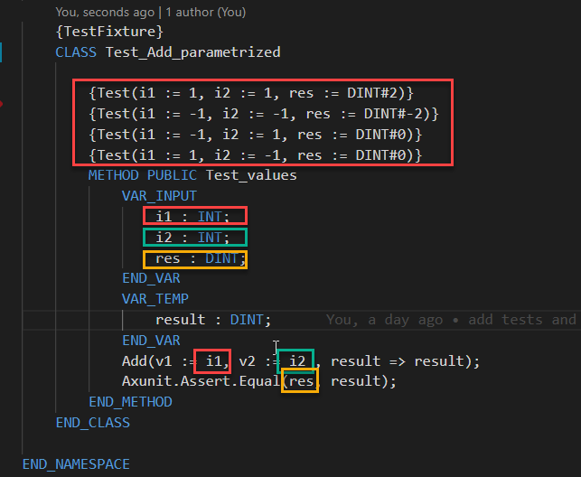
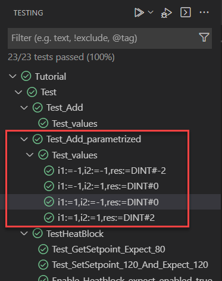
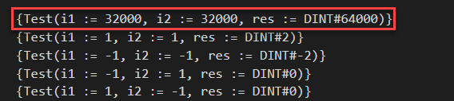
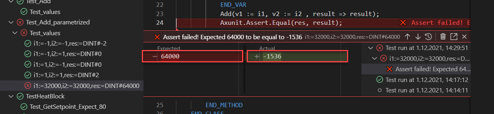
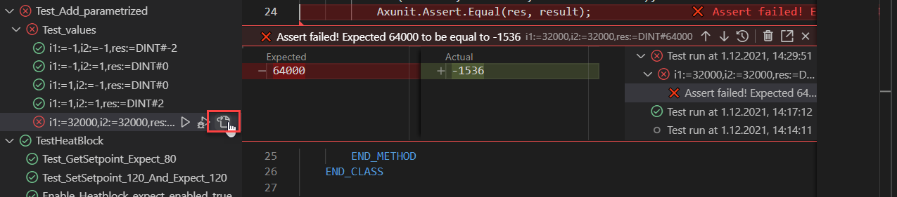
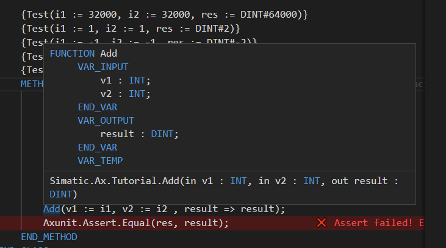

# Parametrized tests

## Goal for this training chapter

- you know what parametrized tests are
- you know how you can add further test cases to parametrized tests
- you've seen how parametrized tests are look like
- you can add further test cases to parametrized tests
- you're able to handle a failed test
- you've can use explicit type conversion

### What are parametrized tests?

1. In some cases you want to test a functions or method with different input parameters. This can be solved in this way:

    ```iec-st
    USING Axunit.Assert;
    USING Simatic.Ax.Tutorial;

    NAMESPACE Tutorial.Test

        {TestFixture}
        CLASS Test_Add

            {Test}
            METHOD PUBLIC Test_values
                VAR_TEMP
                    result : DINT;
                END_VAR
                Add(v1 := 1, v2 := 1 , result => result);
                Equal(2, result);                   

                Add(v1 := -1, v2 := -1 , result => result);
                Equal(DINT#-2, result);            

                Add(v1 := 1, v2 := -1 , result => result);
                Equal(DINT#0, result);            

                Add(v1 := -1, v2 := 1 , result => result);
                Equal(DINT#0, result);            
            END_METHOD
        END_CLASS    

    END_NAMESPACE
    ```

    > you'll find the code in the file `test/Test_Add.st`

    In this case, the Add function will be tested with the input parameter:

    |Test#|v1|v2| expected result
    |-|-|-|-|
    |1.|1|1|2|
    |2.|-1|-1|-2|
    |3.|1|-1|0|
    |3.|-1|1|0|

    Another solution are `parametrized tests`

1. Open the file `Test_Add_Parametrized.st`

1. Uncomment all the code by pressing `STRG + a` (select all) and then `STRG + #` (uncomment all)

    

    Here you see, that the test pragma can also have some parameters. The parameters `i1`, `i2`, `res`  will be forwarded to the input variables `i1`, `i2`, `res` of the method `Test_values`

1. Execute the tests

    In the test explorer you can see, that the test is executed four times with different parameters.

    

### Add further test parameter to the parametrized test

1. If not, open the file `Test_Add_Parametrized.st`

1. Extend the parametrized test by another test case with the values `i1 := 32000`, `i2 := 32000`, and `res := DINT#32000`

    Your test configuration should be look like:

    

1. Execute the test

    Result: you'll get a failed test.

    

    The test shows you, that your expected value `64000` does not match the acual value `-1536`

1. hover over the failed test in the explorer and click on `Go to Test`. The test file will be opened.

   

1. Press `CTRL` hover over the `Add` function. The Add method will be underlined. Click left to jump the `Add` function

    

### Explicit type conversion

1. The problem for our failed test was obviously an integer overflow. Why can I say this? Because I know it.

    A look in line 13 will explain this:

    ```iec-st
    result := v1 + v2;
    ```

    `v1`and `v2`are of the type `INT`. When we add 32000 + 32000, the addition will be done as an integer operation, where the maximum value is 32767.
    To solve this, we've to convert the `INT` to `DINT` explicitly.

1. Replace the line 13 in the file by

    ```iec-st
    result := TO_DINT(v1) + TO_DINT(v2);
    ```

    The integer values will be converted to double integer values

1. Run the tests again

    The tests should now run without errors

## Summary

Goal reached? Check yourself...

- you know what parametrized tests are ✔
- you know how you can add further test cases to parametrized tests ✔
- you've seen how parametrized tests are look like ✔
- you can add further test cases to parametrized tests ✔
- you're able to handle a failed test ✔
- you've can use explicit type conversion ✔

[Back to overview](./../README.md)