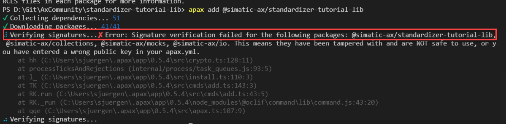

# Public keys

## Goal for this training chapter

After this training session:

- you know, for what the package signature is useful
- you are able to enable the signature check
- you know, where you find your own public key for package creation
- you know, how a new key pair can be created

## For what are public keys for apax packages necessary?

For security reasons, the apax packages are all signed digitally. When somebody manipulates the package on the package registry, apax detects this. 

But by default, the signature of the packages will not checked (Exception packages from the scope `@ax`)

The public key of other packages has to be provided by the publisher of the packages.

## Enable signature check

To enable the signature check of apax, you need 
- the public key of the package creator
- an additional entry in the apax.yml (see below)

> The package creator has to provide the public key
> For packages from the `@ax` scope, the signature check is enabled by default.

```yml
publicKeys:
  "@simatic-ax": <The public key, which has to be provided of the package creator>
```

Example
```yml
publicKeys:
  "@simatic-ax": 0123456789abcdef0123456789abcdef0123456789abcdef0123456789abcdef
```

If the public key is wrong or, even much mor worse, someone has the package on the registry manipulated, you get an error message of apax in the terminal




## Where do you find you public key?

By default, the private key created by the keygen command, which is located in `~/.apax/apax.signkey`

Example of the `apax.signkey` file
```
created: 2022-06-08T13:28:12.461Z
publicKey: 0123456789abcdef0123456789abcdef0123456789abcdef0123456789abcdef
privateKey: SECRET0123456789abcdef0123456789abcdef0123456789abcdef0123456789abcdef
```
> WARNING: Do never publish your private key

## Who needs the private key?
The private key is exclusively needed for the package creator (usually the standardizer).

When you create a package, the key pair from the `apax.signkey` file will be used.

Problem: If multiple people create packages, their keys might be different. That leads to the problem, that the consumer of the package, add multiple public keys in the apax.yml

Solution:

1. Packages will be created always on the same computer 

1. The private key is known for all people who are creating packages. In this case they have to create the packages with the command:

    ```sh
    apax pack --key SECRET0123456789abcdef0123456789abcdef0123456789abcdef0123456789abcdef
    ```

1. Packages will be created in a CI workflow, where the public key is stored as a SECRET variable.

## How can a new key pair created?

If it is necessary, a new key pair can be created with the following command:

```sh
apax keygen --override-existing
```

