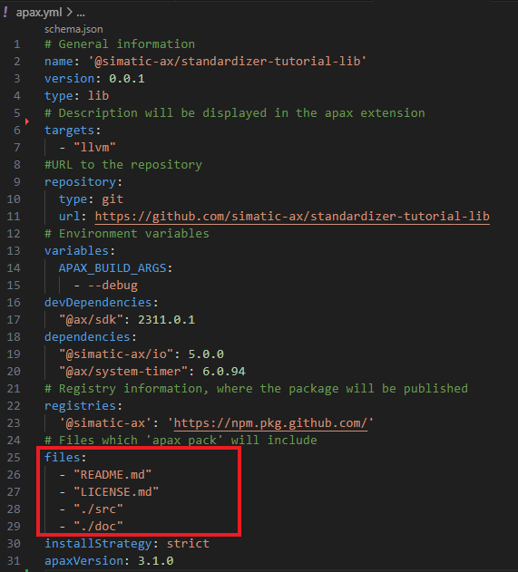

# Pack and publish packages with Apax

## Goal for this training chapter

After this training session:

- you have a rough overview what Apax is and you know the terms `package manager` `library` and `registry`
- you have knowledge how the content of a package can be defined
- you know the workflow, how an apax package will be created
- you know, how scripts can be added to the apax.yml
- you know that cli parameter can forwarded to scripts
- you've knowledge how a package could be transferred to a registry

### Apax the package manager

Apax is the package manager and build system for ST projects. Apax packages can be used to share code and reuse functionality, just like with any other package manager, but we go a step further and deliver the entire ST build toolchain via packages.

[Here](https://console.prod.ax.siemens.cloud/docs/apax) you'll find all information for Apax.

[Here](https://console.prod.ax.siemens.cloud/docs/apax#glossary) you'll find explanations for the terms:

- package manger
- registry
- dependency
- library

### Define the content for a package

1. Before we can create an Apax package, we need to define, what the package shall contain.

1. Open the apax.yml

    

    In the section `files` you seem which folders/files will be shipped with that package.
    Beside the `README.md` and the `LICENCE.md` the complete folders and subfolders of `./src` and `./doc` will be shipped.
    This means, that the package contain the source code and also the documentation for the library. It dos not contain any test code or any binaries.

    >Note: Shipping the compiled binaries instead of the source code is possible, but not part of this tutorial.

### Set the version of the package

1. Before you create your package, you've to set the version. Check the current version in the apax.yml

     

1. In this case the actual version is `0.0.1`. So enter the command:

    ```cli
    apax version 0.0.2
    ```

    Result:

    

    The version in the apax.yml will be changed

1. In the next step, we create a public/private key pair for signing the packages. Enter the following command into the command line:

    ```cli
    apax keygen --override-existing
    ```

1. now we're able to create the package with the command:

    ```cli
    apax pack
    ```

    Result: The package with the name `simatic-ax-standardizer-tutorial-lib-0.0.2.apax.tgz` appears in the explorer on the left side.

    >Tip: you can open the *.tgz file with any zip/unzip program

### 

## Summary

Goal reached? Check yourself...

[Back to overview](./../README.md)