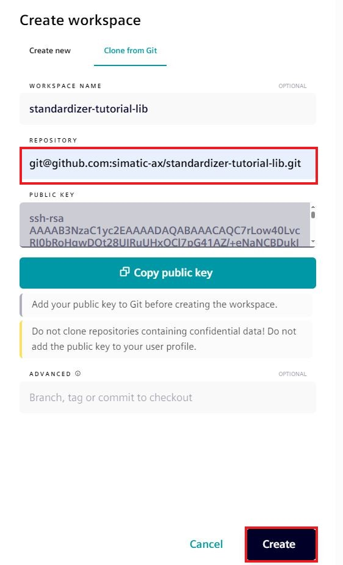
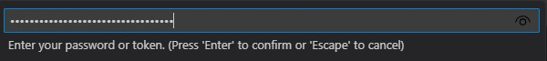
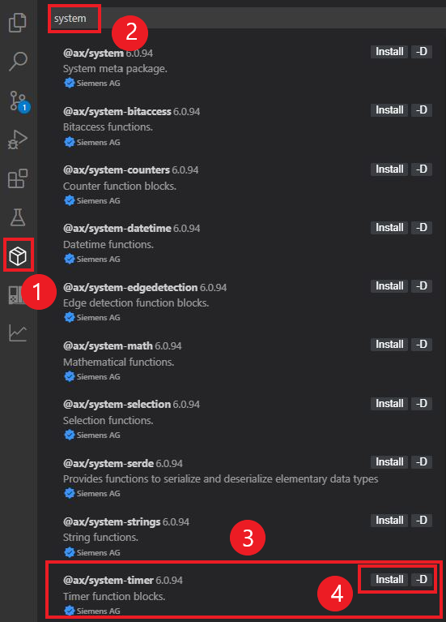

# Setup your library environment

## Goal for this training chapter

After this training session, you will:

- be able to create workspaces using the clone link in the Web IDE
- know how to login to the AX registry
- kwow how to login to other (external) registries
- have a rough overview about `apax.yml`
- learn how to install and update dependencies using the Apax extension
- be familiar with the different project types `lib`/`app`
- know the difference between `devDependencies` and `dependencies`
- know how to add further dependencies

### Cloning the workspace with the clone link

1. Copy the clone link to your clipboard:

    ```iec-st
    git@github.com:simatic-ax/standardizer-tutorial-lib.git
    ```

1. Open the cloud IDE on <https://axcite.me/workspaces>
    > it's possible that you have to login first

1. Click on create

1. Select `Clone from Git`, paste the clone link into the `REPOSITORY` field and press `Create`. Wait until the workspace is created.  

   
    > NOTE: If your AX public key is not in your GitHub profile, the new workspace will not be able to clone the tutorial code.

1. Open the workspace

### Logging into another registry

For this tutorial, further libraries are required which are hosted on a GitHub registry @simatic-ax. To consume them, it is necessary to login into the GitHub registry.

1. Select the file `apax.yml`, click the right mouse button and select `Login to registry`

      

1. Enter the Github URL

       

    ```url
    https://npm.pkg.github.com/
    ```

1. Leave the user name field empty and press `Enter`

      

1. Enter your personal access token from GitHub with `Strg+V` (`Ctrl+V`)

      

Now you are able to install all necessary dependencies to develop your library.

### Introducing apax.yml

If you are already familiar with `Apax` and the `apax.yml` you can skip this section.

If you want to develop a library with SIMATIC AX, you will need some developer tools from the AX SDK (Software Development Kit). The AX SDK contains some components like:
    - AX Compiler
    - AxUnit Testing Framework
    - SIMATIC downloader
    - ...

For this tutorial, only the AX Compiler and the AxUnit Testing Framework are of interest. This tutorial uses some additional dependencies from GitHub.

Before we install all required dependencies, let's have a look into the apax.yml. The apax.yml is a configuration file for the Apax package manager. It contains all relevant information for the workspace.

  

#### **Project information**

The header of this file includes some basic information about the project.

- `name: standardizer-tutorial-lib` Contains the project name. In this case the library has the name `standardizer-tutorial-lib`
- `version: 0.0.1` the version of the library
- `type: lib` the project type is lib (library project) another valid value is `app` (application)

> Note:  
>
> - a library always needs a namespace
> - a library can not be executed directly on a PLC since a library must have a `CONFIGURATION` and a `PROGRAM` section which is necessary to be executed on a PLC

#### **devDependencies**

This section contains dev dependencies which are necessary during development. In this case only the `@ax/sdk` version `0.2.499` is required.

#### **dependencies** and **registries**

In this tutorial, we need some other libraries. Hence these are dependencies which are necessary for building the library.

In this example, an additional library from the `@simatic-ax` registry is required as an `dependency`. In the [apax.yml](../apax.yml) you can find a section `dependencies`:

```yml
dependencies:
"@simatic-ax/io": <version>  # the e.g. <version> = 1.0.1
```

> the version actually used is shown in the [apax.yml](../apax.yml) and may differ from the version shown here.

For now, it's not important to know what the content of this library is. This library are hosted on GitHub simatic-ax. So we need to tell Apax where the GitHub registry is located. This will be done in the section `registries`
Therefore the registries section in the apax.yml is responsible:

```yml
registries:
  '@simatic-ax': 'https://npm.pkg.github.com/'
```

### Install dependencies

1. Right click on `apax.yml` and select `Install dependencies`

      

1. Wait until the following message appears

     

**Alternative workflow:**
You can open a terminal (e.g. by pressing `STRG+SHIFT+ö` German keyboard layout, CTRL+` USA keyboard layout) and press enter

```iec-st
apax install -L 
```

This command is equivalent to `Install dependencies`

### Adding dependencies

If you need further dependencies add them with the `Apax extension`

Example to install the library `@ax/system-timer`

  

   1. Open `apax extension`
   1. Enter `syst` into the text field to filter teh available packages
   1. Select the package `@ax/system-timer`
   1. Click on `install`

Alternatively, you can install the dependencies via command line:

Example:
Install the system library `@ax/system-timer`

```iec-st
apax add @ax/system-timer
```

The result is: you can find an additional entry in th `apax.yml` in the section `dependencies`.

  

If you are wondering why this version is set with `^`0.4.2. That means that at minimum version 0.4.2 has to be used. If there is a version 0.4.3 available, the version 0.4.3 will be installed with the command `apax install` and even with `apax install -L`

> The command `apax update` will install the latest package and removes the `^` and set the version explicitly.
> It's recommended to work with explicit version numbers. Example: `1.0.2` instead of `^1.0.2`.

### Update dependencies

Sometimes, there are newer versions of packages available. These dependencies can also be updated with Apax.

1. Via Apax extension

    

    1. Open `Apax extension` and select the section `IN PROJECT`

    1. Select the package you want to update and click on `Update`

1. Via command line

    1. Enter `apax update` in the terminal (if there are updates available you will get a dialog where you can select the packages you want to update)
    1. Or enter `apax update -a` to update all dependencies automatically

### Summary

Goal reached? Check yourself...

- you are able to create workspaces with clone link in the Web IDE ✔
- the login process for the AX registry is known ✔
- the login into other (external) registries is known ✔
- you have a rough overview about the apax.yml ✔
- you have learned how to install dependencies ✔
- you know the Apax extension ✔
- you know how to update dependencies ✔
- you have heard about the different project types `lib`/`app` ✔
- you know the difference between `devDependencies` and `dependencies` ✔
- you know how to add further dependencies ✔

[Back to overview](./../README.md)
