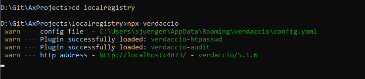
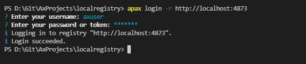
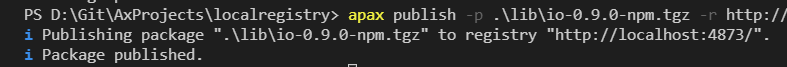

# Setup a local registry with Verdaccio

## Goal for this training chapter
- learn how to publish packages on a registry
- know how to setup a local registry

## Prerequisites
- Node.js >= 4.6.1
- npm or yarn

## Verdaccio as local package registry
For executing the publish packages workflow with Apax, you need a registry. There are some git providers which offer free package registries. For example:

- [GitHub](https://github.com/)
- [GitLab](https://about.gitlab.com/)

But if you have the need (e.g. for training purposes or on site use cases without external internet access, you can setup a local registry)

### Setup

1. Install Verdaccio

    ```
    npm install verdaccio
    ```

1. Start Verdaccio

    ```
    npx verdaccio
    ```

    Result:

    


1.  Configure the apax.yml in order to access the local registry as default

    ```yml
    registries:
      '@simatic-ax': 'https://npm.pkg.github.com/'
      default: http://localhost:4873/
    ```

1. First you need to login into the local registry

    ```
    apax login --registry http://localhost:4873
    ```

    Enter username and password (both can be free chosen at the first time)
    


1. Publish the example  packages to the local registry

    ```
    apax publish --package simatic-ax-standardizer-tutorial-lib-0.0.1.apax.tgz --registry http://localhost:4873/
    ```

    

    You can check the available packages on the [package registry](http://localhost:4873)


## HandsOn

Create a new Version of the package and publish it to the local registry. Check your results.


## Goal reached? Check yourself...
- learn how to publish packages on a registry ✔
- know how to setup a local registry ✔

[Back to overview](./../README.md)