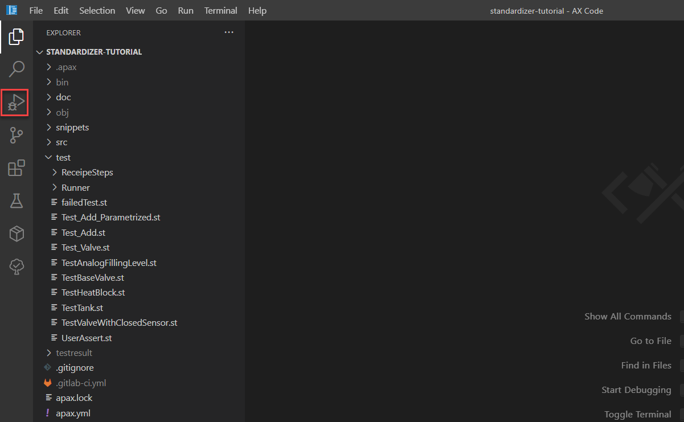
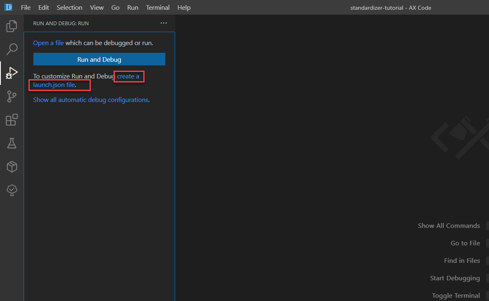
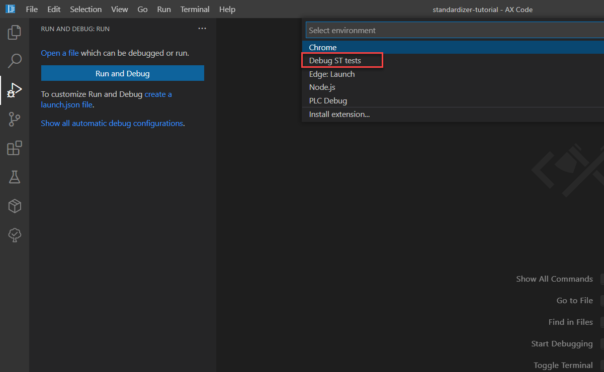
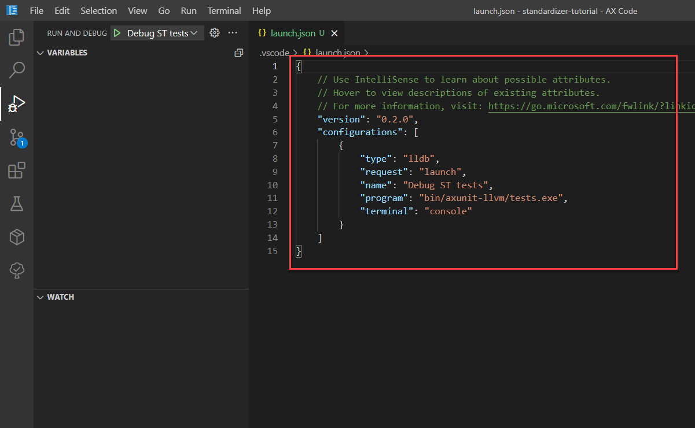
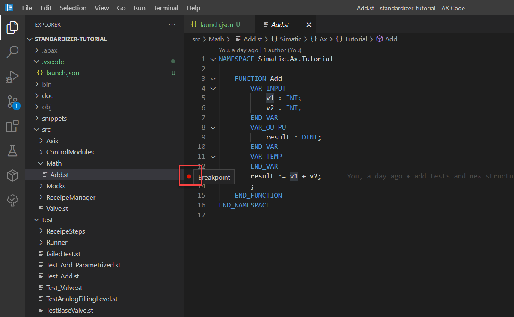
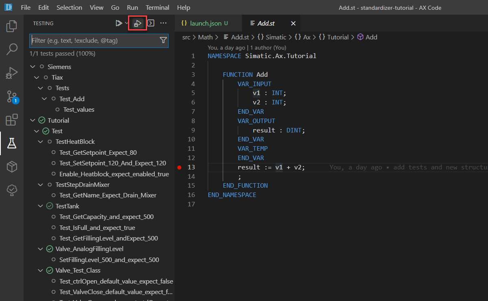
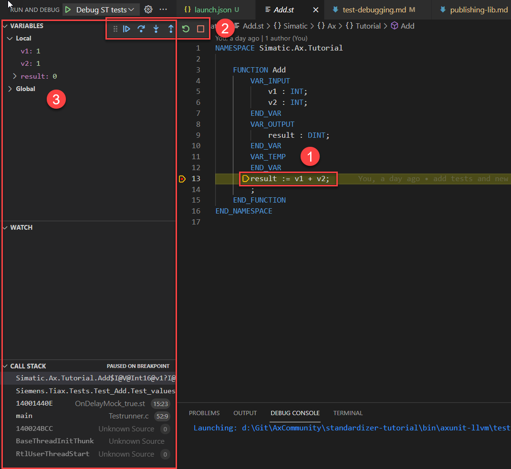

# Debugging of tests

## Goal for this training chapter

After this training session:

- you know enable debugging extension
- you have learned how to set a breakpoint
- you know how to start the debugging
- you know where you find further information regarding the main control panel and different views of the debug extension

### Enable he debug extension within AX Code

To enable the debugging, the debug extension need a configuration file. It's called `launch.json`.

1. Open the debug extension in the left side bar

    

1. Click on `create a launch.json file.

    

    This is needed for the Debug extension. If already a launch.json exists, then this step is not necessary.

1. Select `Debug ST tests`

    

    Result:

    

    >Note: this file must not be changed manually

### Set a breakpoint

1. Open the file `./src/Math/Add.st`

1. Set a breakpoint by clicking left beside the line numbers (see screenshot)

    

### Start debugging

1. Open the test explorer and click on `Debug Tests`

    

1. Watch the result

    

    Explanation:

    1. the debugger stops at the breakpoint
    2. shows the main control panel for debugging. More information you'll find  [here](https://console.prod.ax.siemens.cloud/docs/axcode/debugging-unit-tests#main-controls).
    3. shows the call stack and variables view. More information you'll find [here](https://console.prod.ax.siemens.cloud/docs/axcode/debugging-unit-tests#call-stack)

1. End debugging by pressing `Shift + F5` or clicking on `Stop` on the main control panel

## Summary

Goal reached? Check yourself...

[Back to overview](./../README.md)
