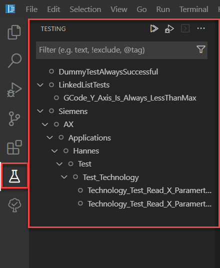
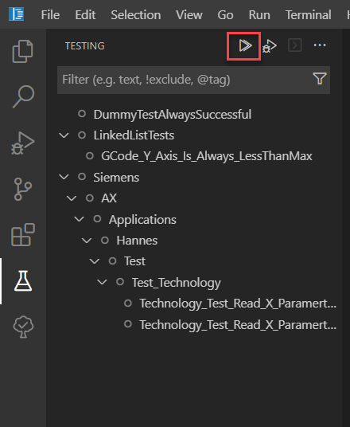
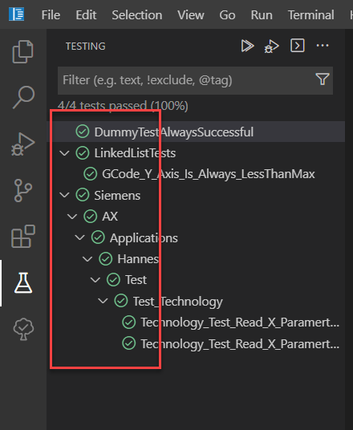

# Usage of the testing framework

## Goal for this training chapter

After this training session:

- you know the test explorer and the `Run tests` button
- you can execute tests within the IDE
- you know the feature `single test execution`
- you've knowledge about the command line based testing
  
### The test explorer and executing tests

In the tutorial, there are a couple predefined tests shipped they can be executed.

1. Open the test explorer

    

1. Run the tests by clicking on `Run Tests`

    

1. See the test results

    

    **Alternative workflow**

    You can also execute the tests by command line command. You've just to enter `apax test` in a terminal.

    ```iec-st
    apax test
    ```

    > Note: in case of executing the tests by command line, the test explorer results will not be updated. The test results will be shown in the command line output.

## Summary

Goal reached? Check yourself...

- you know the test explorer and the `Run tests` button ✔
- you can execute tests within the IDE ✔
- you've knowledge about the command line based testing ✔
