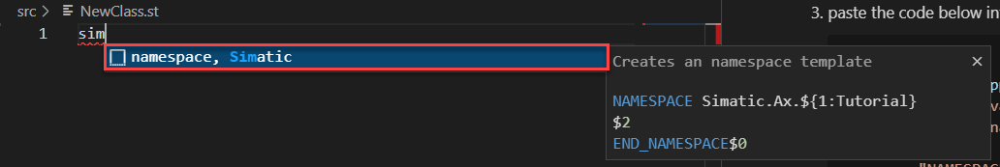
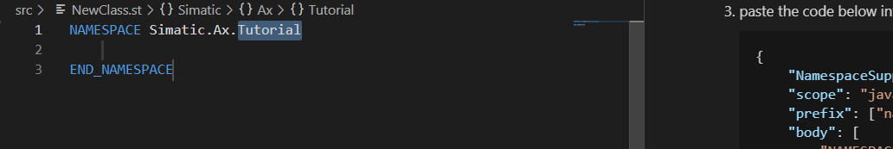
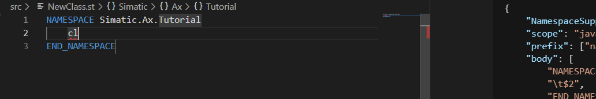

# Create user defined snippets

In the last chapter, we've seen, that namespaces are a really cool feature to structure your code. But it's also a lot effort to write all the time the complete namespace. So before we continue with the testing framework, you'll learn something about a very useful feature within AX Code: `Snippets`. This chapter is not relevant for the standardizer use case. But it is very helpful. If you're familiar with `snippets` or you're not interested in `snippets`, you can jump to the next chapter.

## Goal for this training chapter

After this training session:

- You've learned how a snippet can be created
- You know, where you find more information to create own snippets

### Create a user defined snippet

1. Open the folder snippets

1. Create a file `namespacesupport.json` in the `snippets` folder

1. paste the code below into the file

    ```json
    {
        "NamespaceSupport": {
        "scope": "javascript,typescript,st",
        "prefix": ["namespace, Simatic"],
        "body": [
            "NAMESPACE Simatic.Ax.${1:Tutorial}",
            "\t$2",
            "END_NAMESPACE$0"
        ],
        "description": "Creates an namespace template"
        }    
    }
    ```

1. create a new ST-File (e.g. NewClass.st) in the src folder

### Usage of the user defined snippets

1. Open any st file

1. Enter `sim` and the snippet will be proposed

    

    

1. With `TAB` you can jump to the second row and insert a class for example

    

    > if you enter `cl` and no snippet will be proposed, then press `STRG+blank key`

Further information regarding user defined snippets, you'll find [here](https://console.prod.ax.siemens.cloud/docs/axcode/user-defined-snippets)

## Summary

Goal reached? Check yourself...

- You've learned how a snippet can be created ✔
- You know, where you find more information to create own snippets ✔

[Back to overview](./../README.md)
