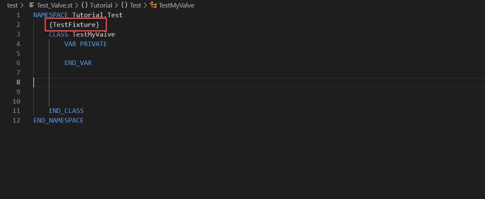
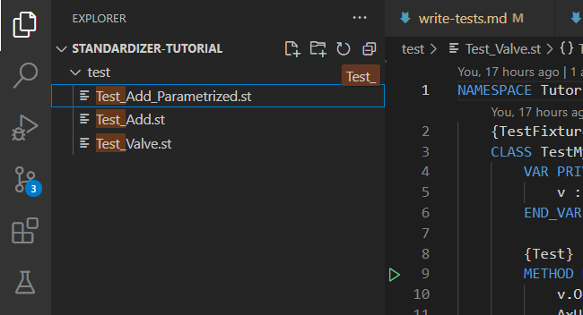
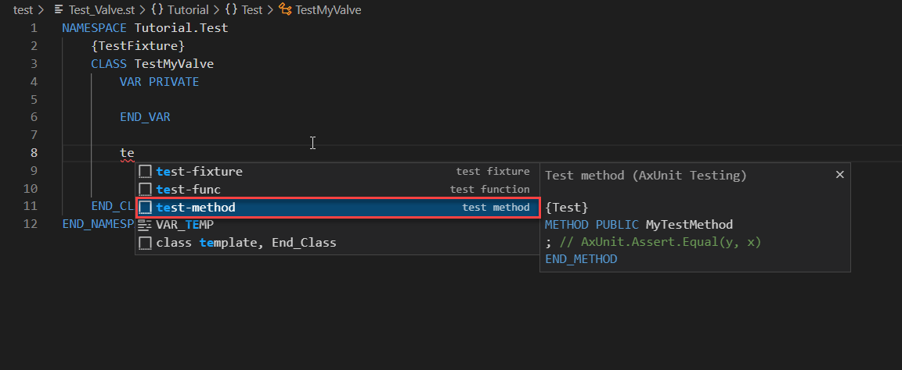
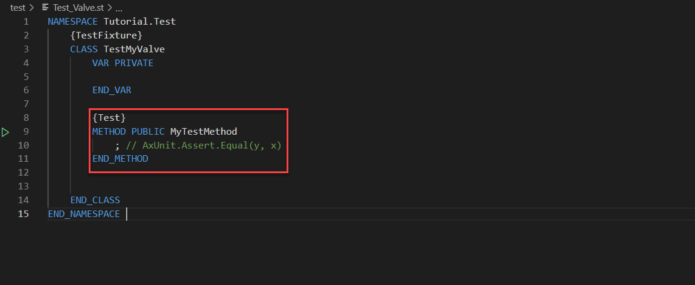

# Write own unit tests with AxUnit

## Goal for this training chapter

After this training session:

- you know how a test class looks like
- you know how you create a test method within a test class
- you know what are assertions and how they're used
- use full qualified type identifier for items in namespaces
- you know, where you find information for writing test functions
- you know where you find guidelines and tips for writing tests

### Create a test for the new implemented class valve

1. Open the file `Test_Valve.st` in the folder `test`

    

    Here you can see a template for a test class. It's marked with the pragma `{TestFixture}`

    > Tip: You can filter the files in the Explorer:
    >
    > 
    >
    > More information you'll find [here](https://code.visualstudio.com/docs/getstarted/userinterface#_explorer)
    >
    > AxUnit support not just test classes. It supports also [test functions](https://console.prod.ax.siemens.cloud/docs/axunit#how-to-write-unit-tests)

1. Insert a test method. By entering `te` the snippet `test-method` will be proposed. And press enter

    

    Test methods will be marked with the pragma `{Test}`

    

1. Change the name of the method to `Test_Open_valve_and_Expect_IsOpen_True`

    > Recommendations for writing tests, you'll find [here](https://console.prod.ax.siemens.cloud/docs/axunit#guidelines-and-tips-for-writing-tests)

1. In the next step we select our class we want to test. Therefore we declare the variable v in the VAR section

    ```iec-st
    VAR PRIVATE
        v : Simatic.Ax.Tutorial.Valve;
    END_VAR
    ```

    In this case we use the full qualified name for the Valve class. This is an alternative to `USING Simatic.Ax.Tutorial;`.

1. To implement the test itself, we modify the method `MyTestMethod` in this way:

    ```iec-st
    {Test}
    METHOD PUBLIC Test_Open_valve_and_Expect_IsOpen_True
        v.Open();
        AxUnit.Assert.Equal(actual := v.IsOpen(), expected := TRUE);
    END_METHOD
    ```

    Explanation:

    1. The method `v.Open()` calls the method Open of the class valve. In this case we expect, that the method `IsOpen()` returns the value `TRUE`

    1. The expression `Equal(actual := v.IsOpen(), expected := TRUE);` contains the assertion `Equal` which check if the returned value of `IsOpen()` equals `TRUE`.

        Further assertions are:
        - NotEqual
        - LessThan
        - GreaterThan
  
        More information regarding testing, you'll find [here]([./images/test_fixture.png](https://console.prod.ax.siemens.cloud/docs/axunit))

## Summary

Goal reached? Check yourself...

- you know how a test class looks like ✔
- you know how you create a test method within a test class ✔
- you know what are assertions and how they're used ✔
- use full qualified type identifier for items in namespaces ✔
- you know, where you find information for writing test functions ✔
- you know where you find guidelines and tips for writing tests ✔
